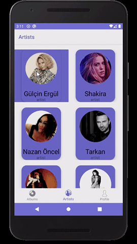
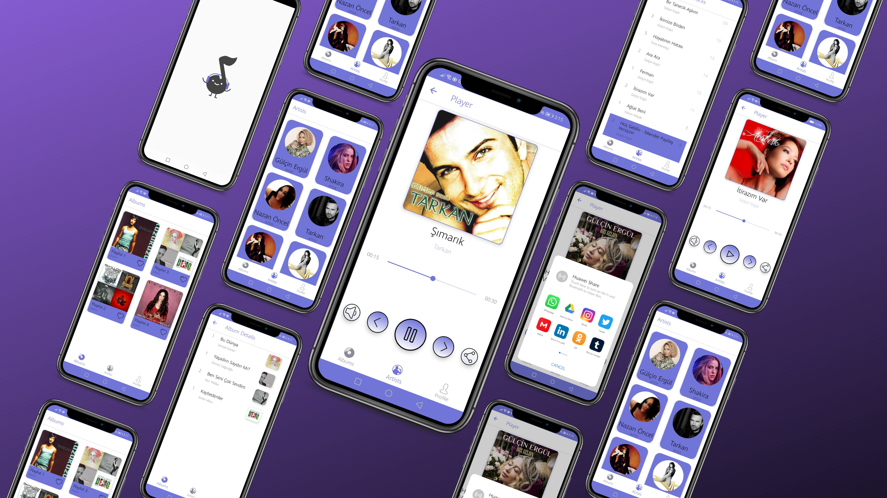
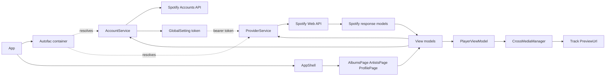
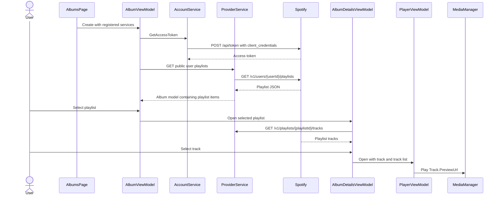

# MusicPlayer

MusicPlayer is a Xamarin.Forms mobile application that browses selected public Spotify data and plays the preview clips supplied with track responses. It combines Shell navigation, MVVM-style presentation logic, REST integration, and cross-platform media controls.

> **Project status:** This is a legacy Xamarin project preserved as a portfolio and learning project. My current mobile work uses native Kotlin and Swift.

## Preview

<p align="center">
  
</p>

<p align="center">
  
</p>

## Overview

The application presents three Shell tabs:

- **Albums** loads the playlists of a fixed public Spotify user; the source names these results “albums,” but the API response and models are playlists
- **Artists** loads a fixed set of Spotify artist IDs and opens each artist's top tracks
- **Profile** loads a fixed public Spotify user profile

Selecting a playlist or artist opens its tracks. Selecting a track creates `PlayerViewModel`, which sends the track's `PreviewUrl` to MediaManager. The player supports pause/resume, mute, next/previous preview, position display, and sharing the preview URL.

## Features

- public Spotify playlist, artist, top-track, and profile requests
- Spotify client-credentials token request
- JSON mapping for Spotify response models
- Shell tab navigation and pushed detail/player pages
- XAML data binding with view models and commands
- MediaManager playback of Spotify preview URLs
- play/pause, mute, next, previous, and share commands
- animated Android splash screen with Lottie
- rounded cards and gradients with PancakeView
- Android and iOS platform projects

## Technology Stack

| Area | Technology |
|---|---|
| Language | C# |
| Shared framework | Xamarin.Forms 5.0.0.2012 on .NET Standard 2.0 |
| UI | XAML, Xamarin.Forms Shell, CollectionView, PancakeView 1.3.7 |
| Architecture | MVVM-style pages, view models, commands, and services |
| Dependency registration | Autofac 6.1.0 |
| Networking | `HttpClient` |
| Serialization | Newtonsoft.Json 13.0.1 |
| External API | Spotify Accounts service and Spotify Web API |
| Media | Plugin.MediaManager.Forms 1.0.8 |
| Animation | Com.Airbnb.Xamarin.Forms.Lottie 3.0.3 |
| Device integration | Xamarin.Essentials 1.6.1 sharing |
| Platforms | Xamarin.Android and Xamarin.iOS |

## Architecture

`App` builds an Autofac container for services implementing `IServiceBase` and sets `AppShell` as the root page. Shell pages create their view models with `IAccountService` and `IProviderService`. The account service obtains a Spotify access token, `HttpHelper` attaches it to a shared `HttpClient`, and the provider service deserializes GET responses into the models used by the page.



The application follows MVVM conventions for binding and commands, while page code-behind still constructs view models and controls navigation. It is therefore best described as MVVM-style rather than as a fully decoupled MVVM implementation.

## Spotify and Playback Flow

The “Albums” flow is implemented as follows:



### Verified Spotify requests

| Method | Endpoint | Used by | Purpose |
|---|---|---|---|
| `POST` | `https://accounts.spotify.com/api/token` | `AccountService` | Obtain an app access token with the client-credentials grant |
| `GET` | `/v1/users/{userId}/playlists` | `AlbumViewModel` | Load a fixed public user's playlists |
| `GET` | `/v1/playlists/{playlistId}/tracks` | `AlbumDetailsViewModel`, `AlbumViewModel` | Load tracks for a selected playlist |
| `GET` | `/v1/artists?ids={artistIds}` | `ArtistsViewModel` | Load a fixed set of artists |
| `GET` | `/v1/artists/{artistId}/top-tracks?country=ES` | `ArtistDetailsViewModel` | Load an artist's top tracks for the configured market |
| `GET` | `/v1/users/{userId}` | `ProfileViewModel` | Load a fixed public profile |

The source also contains a `PlayerViewModel.GetTrack` method for `/v1/tracks/{trackId}`, but its invocation is commented out and it is not part of the active player flow.

### Playback behaviour

`PlayerViewModel` calls:

```csharp
await CrossMediaManager.Current.Play(track?.PreviewUrl);
```

The app therefore plays only the preview URL returned for a track. It does not use Spotify Playback SDKs, control a Spotify Connect device, or stream complete catalogue tracks. If Spotify returns a null or unavailable preview URL, the current code does not provide a fallback.

## Navigation

```text
AppShell
├── AlbumsPage
│   └── AlbumDetailsPage
│       └── PlayerPage
├── ArtistsPage
│   └── ArtistDetailsPage
│       └── PlayerPage
└── ProfilePage
```

`HomePage` and `HomeViewModel` remain in the shared project, but the corresponding Shell tab and its navigation logic are commented out.

## Project Structure

```text
MusicPlayer/
├── MusicPlayer.sln
├── Screenshots/
│   ├── xamarin_musicplayer.gif
│   └── 1.png
└── MusicPlayer/
    ├── MusicPlayer/
    │   ├── Helper/             Shared token and HttpClient helpers
    │   ├── Models/             Spotify response and player models
    │   ├── Services/
    │   │   ├── Account/        Spotify token request
    │   │   └── Provider/       Generic JSON GET service
    │   ├── ViewModel/          Page and player presentation logic
    │   ├── Views/              Xamarin.Forms XAML pages
    │   ├── App.xaml.cs         Service registration and startup
    │   └── AppShell.xaml       Tab navigation
    ├── MusicPlayer.Android/    Android startup, resources, and Lottie splash
    └── MusicPlayer.iOS/        iOS startup and resources
```

## Platform Details

| Platform | Repository configuration |
|---|---|
| Android | Xamarin.Android target framework v10.0; manifest minimum SDK 21 and target SDK 28 |
| iOS | Xamarin.iOS project with minimum OS version 8.0 in `Info.plist` |

The Android startup explicitly initializes MediaManager and the Lottie renderer. The iOS startup initializes Xamarin.Forms but does not contain equivalent MediaManager or Lottie initialization, so media behaviour on iOS requires separate verification.

## Getting Started

### Prerequisites

This project depends on the retired Xamarin toolchain:

- Visual Studio 2019 with the Xamarin mobile workload, or a compatible archived Visual Studio for Mac/Xamarin installation
- Xamarin.Android and the Android SDK required by the project
- macOS, Xcode, and Xamarin.iOS for an iOS build
- a Spotify developer application for API access

### Restore packages

```bash
msbuild MusicPlayer.sln /t:Restore
```

Open `MusicPlayer.sln`, select `MusicPlayer.Android` or `MusicPlayer.iOS` as the startup project, choose a simulator/emulator or device, and build with the corresponding platform toolchain.

### Spotify configuration

The previously committed Spotify client ID and client secret have been removed from
`AccountService`. For a local legacy build, the service reads
`SPOTIFY_CLIENT_ID` and `SPOTIFY_CLIENT_SECRET` from the process environment and
fails explicitly when either value is missing. Any historical credentials must
still be considered exposed and should be revoked and rotated in the Spotify
developer dashboard.

Do not hard-code replacement credentials or distribute a mobile build containing a
client secret. A mobile binary cannot protect it. A maintained redesign should
either:

- obtain app-only tokens through a trusted backend, or
- use a Spotify-supported user authorization flow designed for public clients, such as Authorization Code with PKCE

The fixed public user ID and artist IDs are currently defined in `AlbumViewModel`, `ProfileViewModel`, and `ArtistsViewModel`.

## Local Storage

The application does not implement a local database or persistent cache. The Spotify access token is held only in the in-memory `GlobalSetting` singleton, and API results are stored in view-model collections for the lifetime of the page.

## Build Verification

The documentation audit attempted a full NuGet restore with Mono 6.12 and MSBuild 16.10 on macOS. NuGet reached the package feed and downloaded several dependencies, but repeated TLS connection resets prevented completion for required packages, so compilation was not reached. A full Android or iOS build therefore remains unverified on the current machine and should be performed with a compatible archived Xamarin toolchain.

## Key Engineering Concepts Demonstrated

- REST API integration and bearer-token request headers
- asynchronous network and media operations
- XAML binding and command-driven UI interaction
- Shell navigation between list, detail, and player pages
- interface-based services registered with a dependency container
- JSON model mapping
- preview audio playback, playback state, and device sharing
- platform-specific Android initialization and splash animation

## Limitations

- Xamarin.Forms and its platform toolchains are retired
- the legacy client-credentials flow still requires a developer-only secret at runtime and is not suitable for a distributed mobile application
- the app uses fixed Spotify user and artist identifiers rather than user-driven discovery
- token expiry and refresh are not explicitly managed
- network calls have no cancellation, retry, HTTP status handling, or user-facing error state
- `ProviderService.Post` is not implemented
- preview playback depends on `preview_url` availability
- several asynchronous loads are started with `Task.Run` from constructors
- media-finished handlers and device timers are added for each played track without visible cleanup
- there is no offline cache, automated test suite, analytics, CI configuration, or release automation

## Potential Modernization

Possible modernization steps include rebuilding the UI with native Kotlin and Swift, replacing the embedded client-credentials flow with a secure backend or PKCE-based authorization, introducing typed API clients with cancellation and error handling, separating navigation from page construction, adding lifecycle-safe media state management, making artists and profiles user-configurable, and adding unit and UI tests.

## References

- [Spotify for Developers](https://developer.spotify.com/)
- [XamarinMediaManager](https://github.com/Baseflow/XamarinMediaManager)
- [Xamarin.Forms.PancakeView](https://github.com/sthewissen/Xamarin.Forms.PancakeView)
- [Lottie for Android](https://github.com/airbnb/lottie-android)

## Author

Serkan Seker

## License

No open-source license has currently been specified.
